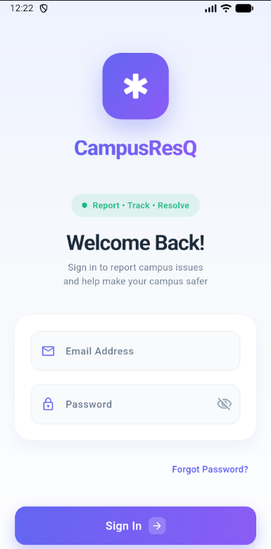
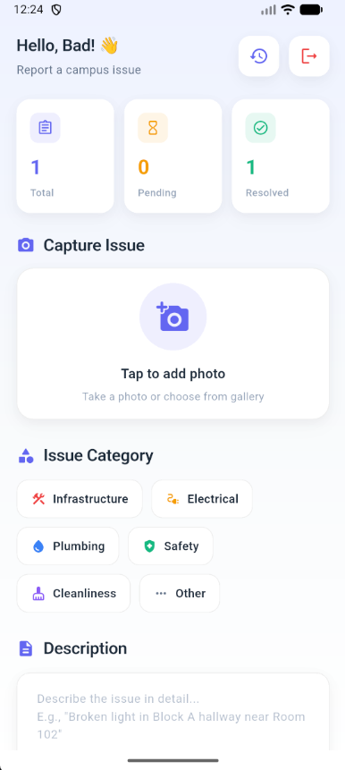
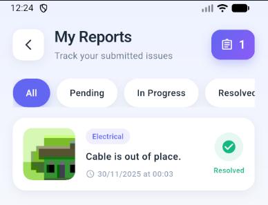
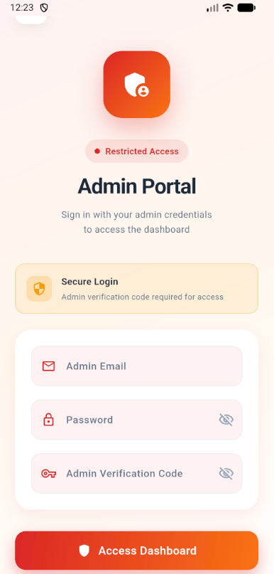
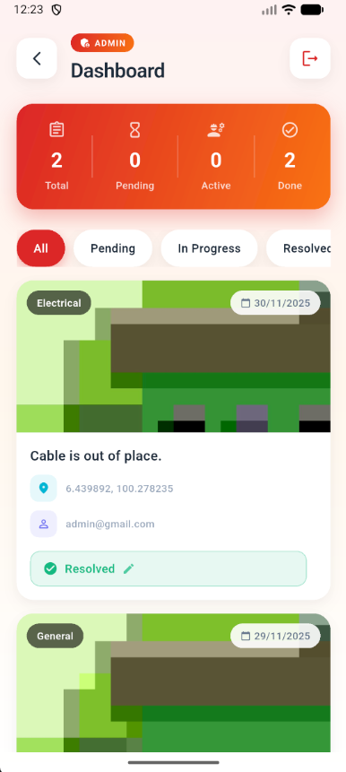

# 🚨 ADUONE

<p align="center">
  
  
  
</p>

<p align="center">
  <b>A modern campus issue reporting mobile application built with Flutter and Firebase</b>
</p>

---

## 📖 Overview

**ADUONE** is a mobile application designed to streamline the process of reporting and managing campus facility issues. Students can easily report problems like broken lights, plumbing issues, or safety hazards, while administrators can efficiently track and resolve these reports.

### ✨ Key Features

- 🔐 **Secure Authentication** - Separate login systems for students and administrators
- 📸 **Photo Capture** - Take photos directly or upload from gallery
- 📍 **Location Details** - User-entered location field (optional GPS coordinates captured when permitted)
- 📊 **Real-time Dashboard** - Live updates using Firebase Firestore
- 🏷️ **Category System** - Organize issues by type (Infrastructure, Electrical, Plumbing, Safety, etc.)
- 📱 **Push Notifications** - Get notified when report status changes
- 🔔 **Admin Bell Notifications** - Admins see pending reports in a notification panel with unread badge
- 📈 **Status Tracking** - Track reports through Pending → In Progress → Resolved
- 📊 **Smart Stats** - Students see Total, In Progress, and Resolved counts at a glance
- 🎨 **Modern UI** - Beautiful 2025 design with animations and gradients

---

## 📱 Screenshots

<table>
  <tr>
    <td align="center"><br/><b>Login</b></td>
    <td align="center"><br/><b>Report Issue</b></td>
    <td align="center"><br/><b>My Reports</b></td>
  </tr>
  <tr>
    <td align="center"><br/><b>Admin Login</b></td>
    <td align="center"><br/><b>Admin Dashboard</b></td>
    <td align="center"></td>
  </tr>
</table>

| Screen | Description |
|--------|-------------|
| **Login** | Modern student login with gradient design and forgot password |
| **Report Issue** | Category selection, photo capture, and location details (optional GPS coordinates) |
| **My Reports** | Timeline view with status tracking and filters |
| **Admin Login** | Secure admin authentication (email allowlist + password) |
| **Admin Dashboard** | Manage reports with bell notifications, status updates, and filters |

---

## 🏗️ Architecture

```
lib/
├── main.dart                 # App entry point with Firebase initialization
├── app_theme.dart            # Theme configuration and color schemes
├── login_page.dart           # Student login with forgot password
├── register_page.dart        # New user registration
├── admin_login_page.dart     # Secure admin authentication
├── report_page.dart          # Issue reporting with camera & location
├── student_history_page.dart # View personal report history
└── admin_page.dart           # Admin dashboard for managing reports
```

### Tech Stack

| Technology | Purpose |
|------------|---------|
| **Flutter** | Cross-platform mobile framework |
| **Dart** | Programming language |
| **Firebase Auth** | User authentication |
| **Cloud Firestore** | Real-time database |
| **Firebase Storage** | Image storage |
| **Firebase Messaging** | Push notifications |
| **Firebase Cloud Functions** | Server-side automation (admin email notifications) |
| **Geolocator** | GPS location services |
| **Image Picker** | Camera and gallery access |

---

## 🚀 Getting Started

### Prerequisites

Before you begin, ensure you have the following installed:

- [Flutter SDK](https://docs.flutter.dev/get-started/install) (3.9.0 or higher)
- [Dart SDK](https://dart.dev/get-dart) (3.9.2 or higher)
- [Android Studio](https://developer.android.com/studio) or [VS Code](https://code.visualstudio.com/)
- [Git](https://git-scm.com/)
- A Firebase project (see Firebase Setup below)

### Installation

1. **Clone the repository**
   ```bash
   git clone https://github.com/amarylleez/ADUONE.git
   cd ADUONE
   ```

2. **Install dependencies**
   ```bash
   flutter pub get
   ```

3. **Set up Firebase** (see [Firebase Setup](#-firebase-setup) section below)

4. **Run the app**
   ```bash
   # For debug mode
   flutter run
   
   # For release mode
   flutter run --release
   ```

---

## 🔥 Firebase Setup

### Step 1: Create a Firebase Project

1. Go to [Firebase Console](https://console.firebase.google.com/)
2. Click "Add Project" and follow the setup wizard
3. Enable Google Analytics (optional)

### Step 2: Add Android App

1. In Firebase Console, click "Add app" → Android
2. Enter package name: `com.example.aduone`
3. Download `google-services.json`
4. Place it in `android/app/` directory

### Step 3: Add iOS App (Optional)

1. In Firebase Console, click "Add app" → iOS
2. Enter bundle ID: `com.example.aduone`
3. Download `GoogleService-Info.plist`
4. Place it in `ios/Runner/` directory

### Step 4: Enable Firebase Services

Navigate to Firebase Console and enable:

| Service | Path | Configuration |
|---------|------|---------------|
| **Authentication** | Build → Authentication | Enable Email/Password provider |
| **Firestore** | Build → Firestore Database | Create database in production/test mode |
| **Storage** | Build → Storage | Set up storage bucket |
| **Messaging** | Build → Cloud Messaging | Enable for push notifications |
| **Functions** | Build → Functions | Enable billing if required by your plan |

### Step 5: Firestore Security Rules

```javascript
rules_version = '2';
service cloud.firestore {
  match /databases/{database}/documents {
    // Admin allowlist
    match /admins/{adminId} {
      // This app checks the admins allowlist before admin sign-in.
      // If you keep that flow, you must allow read access here (consider restricting to a controlled environment).
      allow read: if true;
      allow write: if request.auth != null &&
        get(/databases/$(database)/documents/users/$(request.auth.uid)).data.role == 'admin';
    }

    // Users collection
    match /users/{userId} {
      allow read, write: if request.auth != null && request.auth.uid == userId;
      allow read: if request.auth != null && 
        get(/databases/$(database)/documents/users/$(request.auth.uid)).data.role == 'admin';
    }
    
    // Reports collection
    match /reports/{reportId} {
      allow read: if request.auth != null;
      allow create: if request.auth != null;
      allow update: if request.auth != null && 
        get(/databases/$(database)/documents/users/$(request.auth.uid)).data.role == 'admin';
    }
  }
}
```

### Step 6: Storage Security Rules

```javascript
rules_version = '2';
service firebase.storage {
  match /b/{bucket}/o {
    match /reports/{allPaths=**} {
      allow read: if request.auth != null;
      allow write: if request.auth != null;
    }
  }
}
```

---

## 👤 User Roles

### Student
- Register and login with email/password
- Submit issue reports with photos and location
- View personal report history
- Track report status updates

### Admin
- Access via separate admin login portal
- Authorized admins are allowlisted in Firestore `admins` collection
- **Bell notification icon** shows pending reports requiring attention
- Notification badge displays unread count
- View all submitted reports in a clean dashboard
- Update report status (Pending → In Progress → Resolved)
- Filter reports by status

---

## 🛠️ Development

### Project Structure

```
ADUONE/
├── android/                  # Android-specific files
├── ios/                      # iOS-specific files
├── lib/                      # Dart source code
├── functions/                 # Firebase Cloud Functions (TypeScript)
├── test/                     # Unit and widget tests
├── web/                      # Web support files
├── pubspec.yaml              # Dependencies
└── README.md                 # This file
```

### Running Tests

```bash
# Run all tests
flutter test

# Run with coverage
flutter test --coverage
```

### Building for Release

```bash
# Android APK
flutter build apk --release

# Android App Bundle
flutter build appbundle --release

# iOS (requires macOS)
flutter build ios --release
```

---

## 🤝 Contributing

We welcome contributions! Here's how you can help:

### Getting Started

1. **Fork the repository**
   ```bash
   # Click the 'Fork' button on GitHub
   ```

2. **Clone your fork**
   ```bash
   git clone https://github.com/YOUR_USERNAME/ADUONE.git
   cd ADUONE
   ```

3. **Create a feature branch**
   ```bash
   git checkout -b feature/your-feature-name
   ```

4. **Make your changes**
   - Follow the existing code style
   - Add comments for complex logic
   - Update documentation if needed

5. **Test your changes**
   ```bash
   flutter analyze
   flutter test
   ```

6. **Commit your changes**
   ```bash
   git add .
   git commit -m "feat: add your feature description"
   ```

7. **Push to your fork**
   ```bash
   git push origin feature/your-feature-name
   ```

8. **Create a Pull Request**
   - Go to the original repository
   - Click "New Pull Request"
   - Select your branch and submit

### Commit Message Guidelines

We follow [Conventional Commits](https://www.conventionalcommits.org/):

| Type | Description |
|------|-------------|
| `feat` | New feature |
| `fix` | Bug fix |
| `docs` | Documentation changes |
| `style` | Code style changes (formatting, etc.) |
| `refactor` | Code refactoring |
| `test` | Adding or updating tests |
| `chore` | Maintenance tasks |

Example: `feat: add dark mode support`

### Code Style

- Follow [Effective Dart](https://dart.dev/guides/language/effective-dart) guidelines
- Use meaningful variable and function names
- Keep functions small and focused
- Add documentation comments for public APIs

---

## 📋 Roadmap

- [ ] Dark mode support
- [ ] Multi-language support (i18n)
- [ ] Offline mode with local storage
- [ ] Report analytics dashboard
- [ ] Email notifications for status updates
- [ ] Map view for report locations
- [ ] Report comments/feedback system
- [ ] Image compression optimization
- [ ] Unit and integration tests

---

## 🐛 Known Issues

- Location permission may need to be granted manually on some devices
- Push notifications require additional setup for iOS

---

## ✉️ Admin Email Notifications (Automatic)

By default, admins only see **in-app** notifications when they are actively using the app. This project includes an optional Firebase **Cloud Function** that automatically emails **all admins** when a new report is submitted.

### How It Works

- When a student submits a report, a Firestore document is created in `reports`.
- The Cloud Function `emailAdminsOnNewReport` triggers on `reports/{reportId}` creation.
- It queries the `admins` collection for documents containing an `email` field.
- It sends a single email addressed to all admin email addresses (no student input required).

### Requirements

- Firebase project configured for this app
- Firebase CLI installed (`npm i -g firebase-tools`)
- An SMTP account (example providers: SendGrid SMTP, Mailgun SMTP, Gmail SMTP with an App Password)

### Setup Steps

1) Set your Firebase project ID

- Edit `.firebaserc` and set your Firebase project ID under the `report` alias.

2) Install function dependencies

```bash
cd functions
npm install
```

3) Configure SMTP credentials

The function reads SMTP settings from **environment variables** (recommended for local testing) OR **Firebase Functions runtime config** (recommended for deployed functions).

Option A (Firebase runtime config):

```bash
firebase functions:config:set \
  smtp.host="YOUR_SMTP_HOST" \
  smtp.port="587" \
  smtp.user="YOUR_SMTP_USERNAME" \
  smtp.pass="YOUR_SMTP_PASSWORD" \
  smtp.from="ADUONE <no-reply@yourdomain.com>" \
  smtp.secure="false"
```

Option B (Environment variables - local only):

Set these in your shell before running emulators:

- `SMTP_HOST`
- `SMTP_PORT`
- `SMTP_USER`
- `SMTP_PASS`
- `SMTP_FROM`
- optional: `SMTP_SECURE` (`true`/`false`)

4) Deploy the function

```bash
cd functions
npm run deploy
```

### Notes

- The admin email list comes from Firestore `admins` documents with an `email` field.
- If no admins exist, the function logs a warning and skips sending.
- Email sending happens server-side, so the student app does not need to know any admin emails.

---

## 📄 License

No license file is currently included in this repository.

---

## 🙏 Acknowledgments

- [Flutter Team](https://flutter.dev/) for the amazing framework
- [Firebase](https://firebase.google.com/) for backend services
- [Material Design](https://material.io/) for design guidelines

---

## 📞 Contact

**Project Maintainer:** [@amarylleez](https://github.com/amarylleez)

**Project Link:** [https://github.com/amarylleez/ADUONE](https://github.com/amarylleez/ADUONE)

---

<p align="center">
  Made with ❤️ for campus safety
</p>
